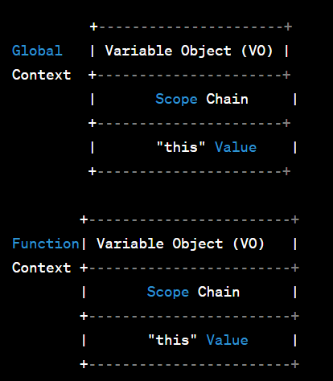

Execution context is an abstract concept in JavaScript that defines the environment in which JavaScript code is executed. It includes variables, functions, objects, and the scope chain necessary for the code to run.

When JavaScript code is executed, it is always executed within an execution context. There are three main types of execution contexts in JavaScript:

1. Global Execution Context:
   - The default and outermost execution context.
   - Represents the global scope.
   - Contains global variables and functions accessible throughout the entire script.

2. Function Execution Context:
   - Created when a function is invoked.
   - Represents the scope of the function.
   - Contains local variables, function arguments, and inner functions.

3. Eval Execution Context:
   - Created when code is executed using the `eval()` function.
   - Represents the scope of the evaluated code.
   - Not commonly used and beyond the scope of this explanation.

Each execution context consists of three key components:

1. Variable Object (VO):
   - Contains variables, function declarations, and function arguments.
   - Serves as the container for all the variables and functions defined within the context.
   - In the global execution context, the variable object is the global object (`window` in browsers, `global` in Node.js).
   - In a function execution context, the variable object also includes the function's arguments and local variables.

2. Scope Chain:
   - A list of variable objects that represents the scope hierarchy.
   - Determines the order in which variables are accessed and resolved.
   - The scope chain is formed by traversing through nested functions and their respective variable objects.

3. "this" Value:
   - Refers to the current object (the object that the function/method is a property of) within the execution context.
   - Its value depends on how a function is invoked.

Here's a simplified diagram illustrating the concept of execution contexts:

```
         +----------------------+
Global   | Variable Object (VO) |
Context  +----------------------+
         |       Scope Chain     |
         +----------------------+
         |       "this" Value    |
         +----------------------+

        +------------------------+
Function| Variable Object (VO)   |
Context +------------------------+
        |       Scope Chain      |
        +------------------------+
        |       "this" Value     |
        +------------------------+
```

In the diagram, each execution context has its own variable object, scope chain, and "this" value. The global execution context exists throughout the entire script, while function execution contexts are created when functions are invoked and destroyed when they complete.

The scope chain is crucial for variable resolution, allowing variables to be accessed in nested functions or scopes. When a variable is not found in the current variable object, the JavaScript engine looks up the scope chain until it finds the variable or reaches the global execution context.

Understanding execution contexts and their components is essential for comprehending how JavaScript code is executed and how variables and functions are scoped and accessed within different parts of the code.